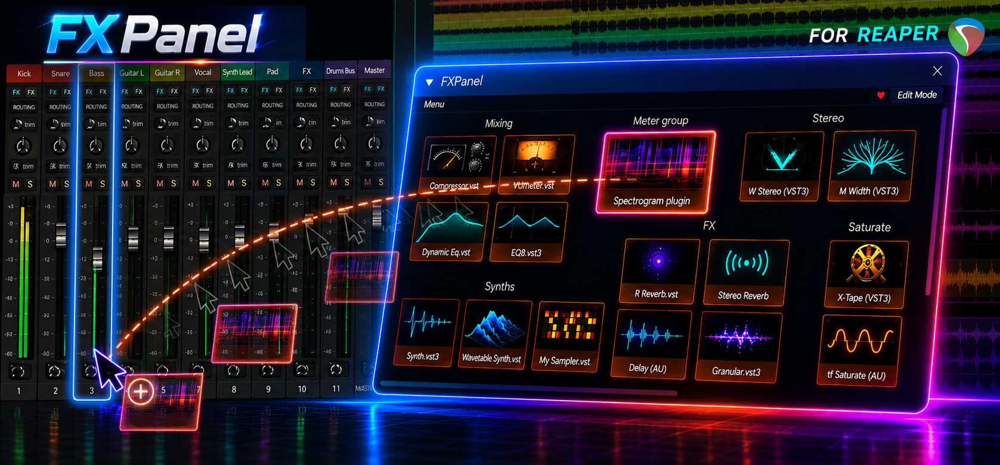

# FXPanel for Reaper



A quick-access floating panel for adding your favorite FX to tracks in REAPER —
drag-and-drop layout, per-button images, and a built-in FX browser.


## Features

- **Quick-access buttons** — add any VST, VST3, AU or CLAP plugin to a track in one click
- **Drag-and-drop layout** — arrange buttons freely on a grid, move and resize the panel
- **Per-button images** — assign your own PNG/JPEG thumbnails to each plugin
- **Built-in FX browser** — search and filter all installed plugins by name or type
- **Persistent layout** — positions and images survive Reaper restarts
- **Lightweight** — runs as a floating ReaScript panel, no install wizard


## Preview


## Requirements

- **REAPER 7+**
- **ReaImGui** extension — install it first via ReaPack (step 1 below)


## Install

**1. Install ReaPack** (if you don't have it) — [download](https://reapack.com) · [installation guide](https://reapack.com/user-guide#installation).

**2. Install ReaImGui** — in REAPER: Extensions → ReaPack → Browse packages → search for **ReaImGui** → Install → restart REAPER.

**3. Add FXPanel repository** — Extensions → ReaPack → Import repositories → paste this URL:
```
https://raw.githubusercontent.com/sashsvamir/reaper-fxpanel/main/index.xml
```

**4. Install FXPanel** — Extensions → ReaPack → Browse packages → search for **FXPanel** → Install → restart REAPER.

**5. Open the panel** — Actions → Show action list → search for **FXPanel** → double-click to run. Optionally assign a keyboard shortcut.


## Support

This panel is free. If it saves you time, you can support development on
[Gumroad](https://9938631577640.gumroad.com/l/gkkgxj).
