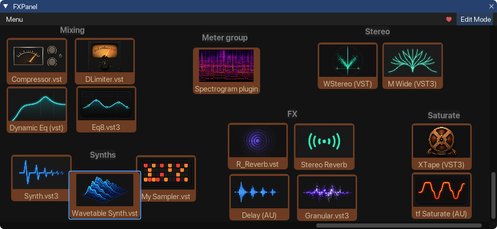

# FXPanel for Reaper

A quick-access floating panel for adding your favorite FX to tracks in REAPER —
drag-and-drop layout, per-button images, and a built-in FX browser.

## Requirements

- **REAPER 7+**
- **ReaImGui** extension (install via ReaPack: Extensions → ReaPack → Browse packages)

## Install

Via ReaPack — import this repository's index URL, then find **FXPanel
for Reaper** in the package list and install.

Then bind it to a key or toolbar button: Actions → Show action list →
find *FXPanel* → add shortcut.

## Support

This panel is free. If it saves you time, you can support development on
[Gumroad](https://9938631577640.gumroad.com/l/gkkgxj).
